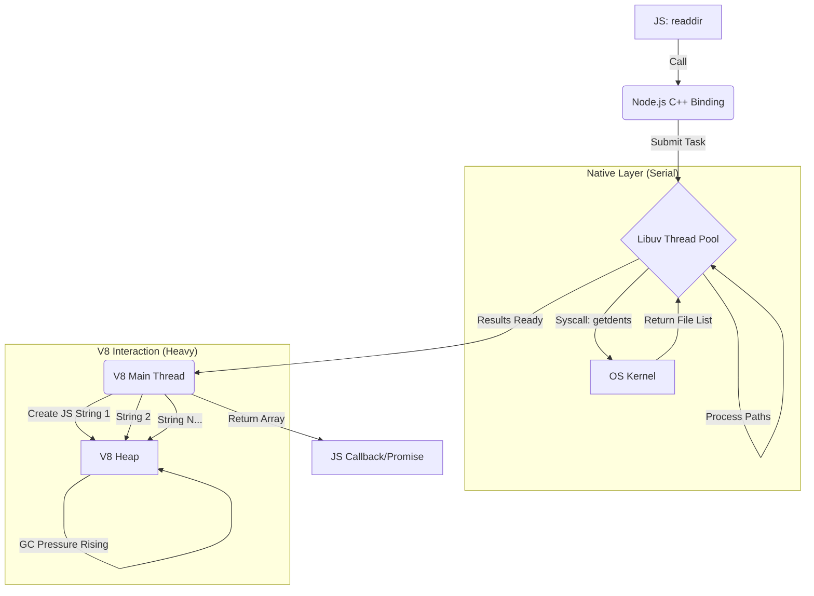
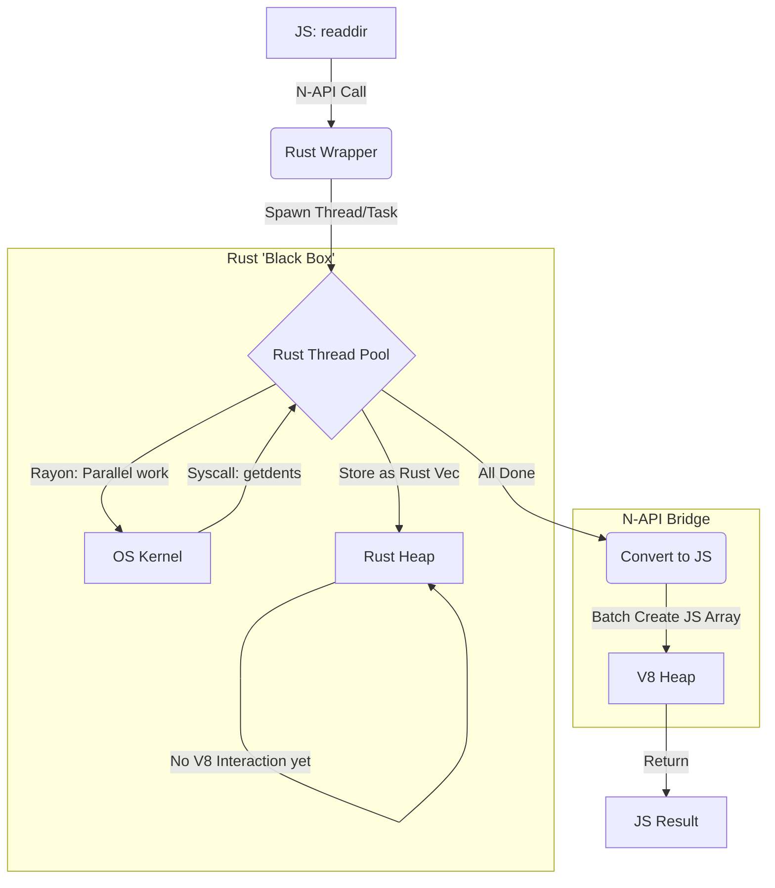

<div align="center">
  
# Hyper-FS
  
  <p align="center">
    
    
    
  </p>
  
  <p align="center">
    A high-performance, drop-in replacement for Node.js <code>fs</code> module, powered by Rust.
  </p>
</div>

## Installation (⚠️ Not Ready Yet)

```bash
npm install hyper-fs
# or
pnpm add hyper-fs
```

## How does it works

For the original Node.js, it works serially and cost lots of memory to parse os object and string into JS style: 



But, it's saved with Rust now:




## Status & Roadmap

We are rewriting `fs` APIs one by one.

> **Legend**
>
> - ✅: Fully Supported
> - 🚧: Partially Supported / WIP
> - ✨：New feature from hyper-fs
> - ❌: Not Supported Yet

### `readdir`

- **Node.js Arguments**:
  ```ts
  path: string; // ✅
  options?: {
    encoding?: string; // ❌
    withFileTypes?: boolean; // ✅
    recursive?: boolean; // ✅
    concurrency?: number; // ✨
  };
  ```
- **Return Type**:
  ```ts
    string[]
    | {
      name: string, // ✅
      parentPath: string, // ✅
      isDir: boolean // ✅
    }[]
  ```

### `readFile`

- **Status**: ❌

### `writeFile`

- **Status**: ❌

### `copyFile`

- **Status**: ❌

### `mkdir`

- **Status**: ❌

### `rm`

- **Node.js Arguments**:
  ```ts
  path: string; // ✅
  options?: {
    force?: boolean; // ✅
    maxRetries?: number; // ❌
    recursive?: boolean; // ✅
    retryDelay?: number; // ❌
    concurrency?: number; // ✨
  };
  ```
- **Return Type**:
  ```ts
    void
  ```

### `rmdir`

- **Status**: ❌

### `stat`

- **Status**: ❌

### `lstat`

- **Status**: ❌

### `fstat`

- **Status**: ❌

### `access`

- **Status**: ❌

### `open`

- **Status**: ❌

### `opendir`

- **Status**: ❌

### `close`

- **Status**: ❌

### `unlink`

- **Status**: ❌

### `rename`

- **Status**: ❌

### `readlink`

- **Status**: ❌

### `realpath`

- **Status**: ❌

### `chmod`

- **Status**: ❌

### `chown`

- **Status**: ❌

### `utimes`

- **Status**: ❌

### `truncate`

- **Status**: ❌

### `appendFile`

- **Status**: ❌

### `watch`

- **Status**: ❌

## Usage

```ts
import { readdir } from 'hyper-fs'

// Basic usage
const files = await readdir('./src')

// Recursive with file types
const entries = await readdir('./src', {
  recursive: true,
  withFileTypes: true,
})
```

## License

MIT
