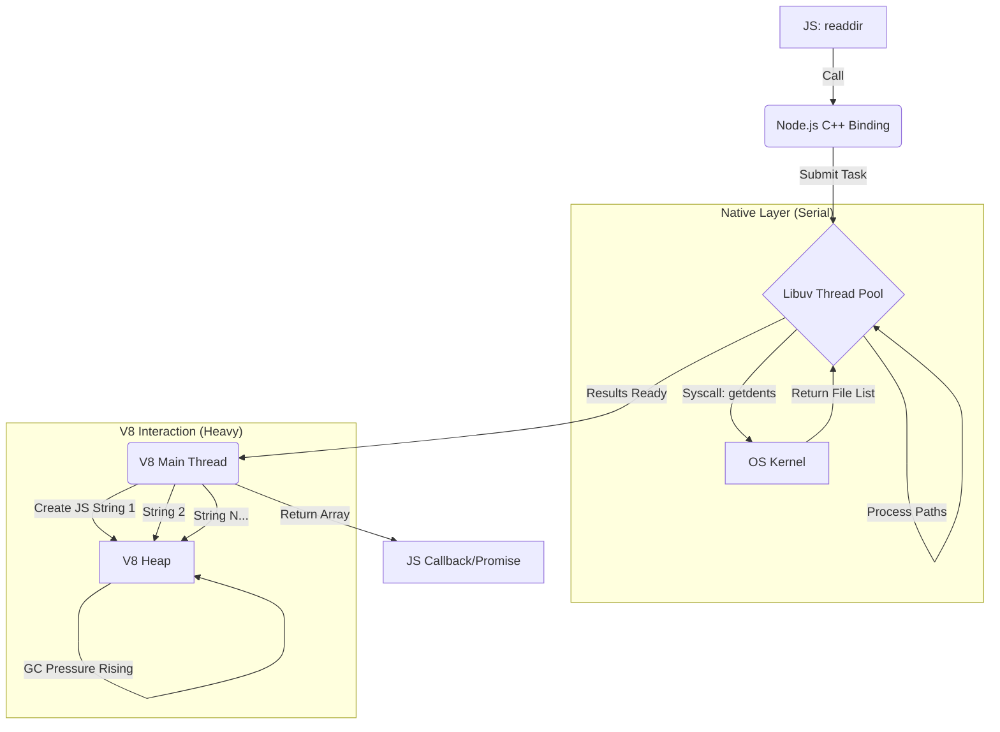
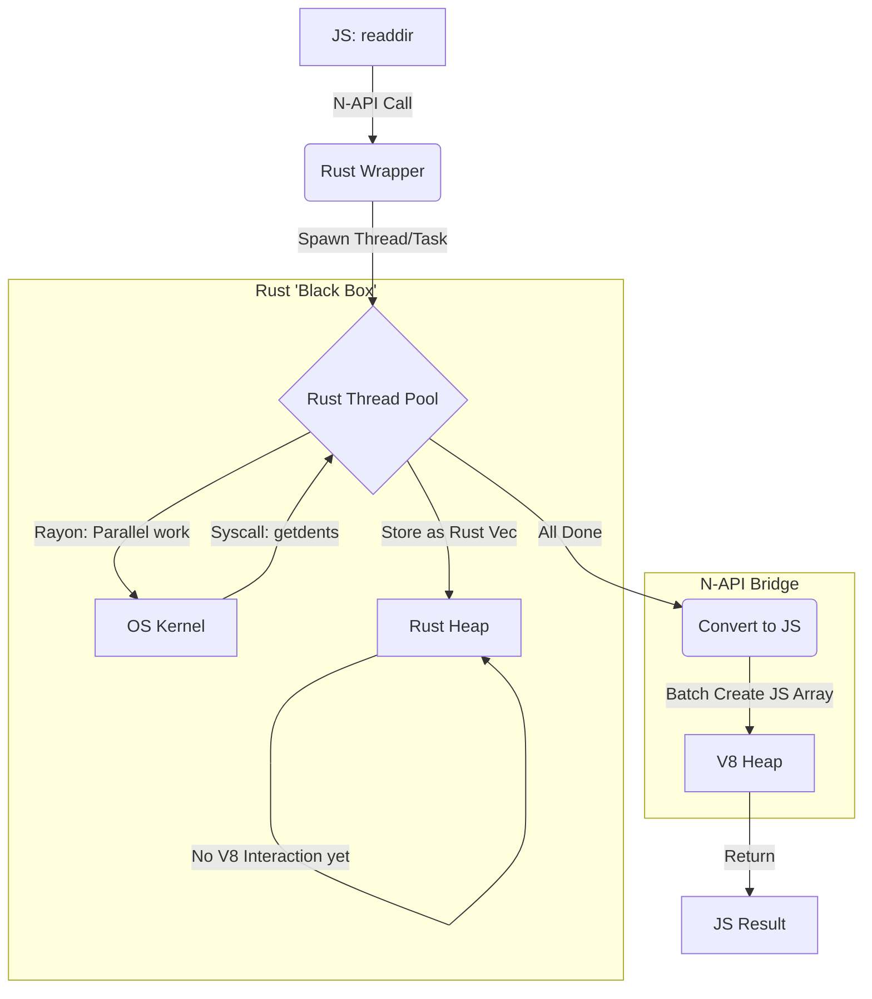

<div align="center">

# Rush-FS

<p align="center">
  
  
  
</p>

<p align="center">
  A high-performance, drop-in replacement for Node.js <code>fs</code> module, powered by Rust.
</p>

</div>

## Installation

```bash
npm install rush-fs
# or
pnpm add rush-fs
```

## How does it works

For the original Node.js, it works serially and cost lots of memory to parse os object and string into JS style:



But, it's saved with Rust now:



## How does it works

For the original Node.js, it works serially and cost lots of memory to parse os object and string into JS style:


But, it's saved with Rust now:


## Status & Roadmap

We are rewriting `fs` APIs one by one.

> **Legend**
>
> - ✅: Fully Supported
> - 🚧: Partially Supported / WIP
> - ✨：New feature from rush-fs
> - ❌: Not Supported Yet

### `readdir`

- **Node.js Arguments**:
  ```ts
  path: string; // ✅
  options?: {
    encoding?: string; // 🚧 ('utf8' default; 'buffer' not supported)
    withFileTypes?: boolean; // ✅
    recursive?: boolean; // ✅
    concurrency?: number; // ✨
  };
  ```
- **Return Type**:
  ```ts
    string[]
    | {
      name: string, // ✅
      parentPath: string, // ✅
      isDir: boolean // ✅
    }[]
  ```

### `readFile`

- **Node.js Arguments**:
  ```ts
  path: string; // ✅
  options?: {
    encoding?: string; // ✅ (utf8, ascii, latin1, base64, base64url, hex)
    flag?: string; // ✅ (r, r+, w+, a+, etc.)
  };
  ```
- **Return Type**: `string | Buffer`

### `writeFile`

- **Node.js Arguments**:
  ```ts
  path: string; // ✅
  data: string | Buffer; // ✅
  options?: {
    encoding?: string; // ✅ (utf8, ascii, latin1, base64, base64url, hex)
    mode?: number; // ✅
    flag?: string; // ✅ (w, wx, a, ax)
  };
  ```

### `appendFile`

- **Node.js Arguments**:
  ```ts
  path: string; // ✅
  data: string | Buffer; // ✅
  options?: {
    encoding?: string; // ✅ (utf8, ascii, latin1, base64, base64url, hex)
    mode?: number; // ✅
    flag?: string; // ✅
  };
  ```

### `copyFile`

- **Node.js Arguments**:
  ```ts
  src: string; // ✅
  dest: string; // ✅
  mode?: number; // ✅ (COPYFILE_EXCL)
  ```

### `cp`

- **Node.js Arguments** (Node 16.7+):
  ```ts
  src: string; // ✅
  dest: string; // ✅
  options?: {
    recursive?: boolean; // ✅
    force?: boolean; // ✅ (default: true)
    errorOnExist?: boolean; // ✅
    preserveTimestamps?: boolean; // ✅
    dereference?: boolean; // ✅
    verbatimSymlinks?: boolean; // ✅
    concurrency?: number; // ✨
  };
  ```

### `mkdir`

- **Node.js Arguments**:
  ```ts
  path: string; // ✅
  options?: {
    recursive?: boolean; // ✅
    mode?: number; // ✅
  };
  ```
- **Return Type**: `string | undefined` (first created path when recursive)

### `rm`

- **Node.js Arguments**:
  ```ts
  path: string; // ✅
  options?: {
    force?: boolean; // ✅
    maxRetries?: number; // ✅
    recursive?: boolean; // ✅
    retryDelay?: number; // ✅ (default: 100ms)
    concurrency?: number; // ✨
  };
  ```

### `rmdir`

- **Node.js Arguments**:
  ```ts
  path: string // ✅
  ```

### `stat`

- **Node.js Arguments**:
  ```ts
  path: string // ✅
  ```
- **Return Type**: `Stats`
  - Numeric fields: `dev`, `mode`, `nlink`, `uid`, `gid`, `rdev`, `blksize`, `ino`, `size`, `blocks`, `atimeMs`, `mtimeMs`, `ctimeMs`, `birthtimeMs`
  - **Date fields**: `atime`, `mtime`, `ctime`, `birthtime` → `Date` objects ✅
  - Methods: `isFile()`, `isDirectory()`, `isSymbolicLink()`, ...
- **Error distinction**: `ENOENT` vs `EACCES` ✅

### `lstat`

- **Node.js Arguments**:
  ```ts
  path: string // ✅
  ```
- **Return Type**: `Stats`

### `fstat`

- **Status**: ❌

### `access`

- **Node.js Arguments**:
  ```ts
  path: string; // ✅
  mode?: number; // ✅ (F_OK, R_OK, W_OK, X_OK)
  ```

### `exists`

- **Node.js Arguments**:
  ```ts
  path: string // ✅
  ```
- **Return Type**: `boolean`

### `open`

- **Status**: ❌

### `opendir`

- **Status**: ❌

### `close`

- **Status**: ❌

### `unlink`

- **Node.js Arguments**:
  ```ts
  path: string // ✅
  ```

### `rename`

- **Node.js Arguments**:
  ```ts
  oldPath: string // ✅
  newPath: string // ✅
  ```

### `readlink`

- **Node.js Arguments**:
  ```ts
  path: string // ✅
  ```
- **Return Type**: `string`

### `realpath`

- **Node.js Arguments**:
  ```ts
  path: string // ✅
  ```
- **Return Type**: `string`

### `chmod`

- **Node.js Arguments**:
  ```ts
  path: string // ✅
  mode: number // ✅
  ```

### `chown`

- **Node.js Arguments**:
  ```ts
  path: string // ✅
  uid: number // ✅
  gid: number // ✅
  ```

### `utimes`

- **Node.js Arguments**:
  ```ts
  path: string // ✅
  atime: number // ✅
  mtime: number // ✅
  ```

### `truncate`

- **Node.js Arguments**:
  ```ts
  path: string; // ✅
  len?: number; // ✅
  ```

### `glob`

- **Node.js Arguments**:
  ```ts
  pattern: string; // ✅
  options?: {
    cwd?: string; // ✅
    withFileTypes?: boolean; // ✅
    exclude?: string[]; // ✅
    concurrency?: number; // ✨
    gitIgnore?: boolean; // ✨
  };
  ```

### `symlink`

- **Node.js Arguments**:
  ```ts
  target: string // ✅
  path: string // ✅
  type?: 'file' | 'dir' | 'junction' // ✅ (Windows only, ignored on Unix)
  ```

### `link`

- **Node.js Arguments**:
  ```ts
  existingPath: string // ✅
  newPath: string // ✅
  ```

### `mkdtemp`

- **Node.js Arguments**:
  ```ts
  prefix: string // ✅
  ```
- **Return Type**: `string`
- Uses OS-level random source (`/dev/urandom` on Unix, `BCryptGenRandom` on Windows) with up to 10 retries ✅

### `watch`

- **Status**: ❌

## Usage

```ts
import { readdir, stat, readFile, writeFile, mkdir, rm } from 'rush-fs'

// Read directory
const files = await readdir('./src')

// Recursive with file types
const entries = await readdir('./src', {
  recursive: true,
  withFileTypes: true,
})

// Read / write files
const content = await readFile('./package.json', { encoding: 'utf8' })
await writeFile('./output.txt', 'hello world')

// File stats
const s = await stat('./package.json')
console.log(s.size, s.isFile())

// Create directory
await mkdir('./new-dir', { recursive: true })

// Remove
await rm('./temp', { recursive: true, force: true })
```

## Benchmarks

> Tested on Apple Silicon (arm64), Node.js 24.0.2, release build with LTO.
> Run `pnpm build && pnpm bench` to reproduce.

### Where Rush-FS Shines

These are the scenarios where Rust's parallelism and zero-copy I/O make a real difference:

| Scenario                                         | Node.js   | Rush-FS  | Speedup   |
| ------------------------------------------------ | --------- | -------- | --------- |
| `readdir` recursive (node_modules, ~30k entries) | 281 ms    | 23 ms    | **12x**   |
| `glob` recursive (`**/*.rs`)                     | 25 ms     | 1.46 ms  | **17x**   |
| `glob` recursive vs fast-glob                    | 102 ms    | 1.46 ms  | **70x**   |
| `copyFile` 4 MB                                  | 4.67 ms   | 0.09 ms  | **50x**   |
| `readFile` 4 MB utf8                             | 1.86 ms   | 0.92 ms  | **2x**    |
| `readFile` 64 KB utf8                            | 42 µs     | 18 µs    | **2.4x**  |
| `rm` 2000 files (4 threads)                      | 92 ms     | 53 ms    | **1.75x** |
| `access` R_OK (directory)                        | 4.18 µs   | 1.55 µs  | **2.7x**  |
| `cp` 500-file flat dir (4 threads)               | 86.45 ms  | 32.88 ms | **2.6x**  |
| `cp` tree dir ~363 nodes (4 threads)             | 108.73 ms | 46.88 ms | **2.3x**  |

### On Par with Node.js

Single-file operations have a ~0.3 µs napi bridge overhead, making them roughly equivalent:

| Scenario                   | Node.js | Rush-FS | Ratio |
| -------------------------- | ------- | ------- | ----- |
| `stat` (single file)       | 1.45 µs | 1.77 µs | 1.2x  |
| `readFile` small (Buffer)  | 8.86 µs | 9.46 µs | 1.1x  |
| `writeFile` small (string) | 74 µs   | 66 µs   | 0.9x  |
| `writeFile` small (Buffer) | 115 µs  | 103 µs  | 0.9x  |
| `appendFile`               | 30 µs   | 27 µs   | 0.9x  |

### Where Node.js Wins

Lightweight built-in calls where napi overhead is proportionally large:

| Scenario                     | Node.js | Rush-FS | Note                              |
| ---------------------------- | ------- | ------- | --------------------------------- |
| `existsSync` (existing file) | 444 ns  | 1.34 µs | Node.js internal fast path        |
| `accessSync` F_OK            | 456 ns  | 1.46 µs | Same — napi overhead dominates    |
| `writeFile` 4 MB string      | 2.93 ms | 5.69 ms | Large string crossing napi bridge |

### Parallelism

Rush-FS uses multi-threaded parallelism for operations that traverse the filesystem:

| API                   | Library                                                                   | `concurrency` option | Default |
| --------------------- | ------------------------------------------------------------------------- | -------------------- | ------- |
| `readdir` (recursive) | [jwalk](https://github.com/Byron/jwalk)                                   | ✅                   | auto    |
| `glob`                | [ignore](https://github.com/BurntSushi/ripgrep/tree/master/crates/ignore) | ✅                   | 4       |
| `rm` (recursive)      | [rayon](https://github.com/rayon-rs/rayon)                                | ✅                   | 1       |
| `cp` (recursive)      | [rayon](https://github.com/rayon-rs/rayon)                                | ✅                   | 1       |

Single-file operations (`stat`, `readFile`, `writeFile`, `chmod`, etc.) are atomic syscalls — parallelism does not apply.

### Key Takeaway

**Rush-FS excels at recursive / batch filesystem operations** (readdir, glob, rm, cp) where Rust's parallel walkers deliver 2–70x speedups. For single-file operations it performs on par with Node.js. The napi bridge adds a fixed ~0.3 µs overhead per call, which only matters for sub-microsecond operations like `existsSync`.

**`cp` benchmark detail** (Apple Silicon, release build):

| Scenario                                  | Node.js   | Rush-FS 1T | Rush-FS 4T | Rush-FS 8T |
| ----------------------------------------- | --------- | ---------- | ---------- | ---------- |
| Flat dir (500 files)                      | 86.45 ms  | 61.56 ms   | 32.88 ms   | 36.67 ms   |
| Tree dir (breadth=4, depth=3, ~84 nodes)  | 23.80 ms  | 16.94 ms   | 10.62 ms   | 9.76 ms    |
| Tree dir (breadth=3, depth=5, ~363 nodes) | 108.73 ms | 75.39 ms   | 46.88 ms   | 46.18 ms   |

Optimal concurrency for `cp` is **4 threads** on Apple Silicon — beyond that, I/O bandwidth becomes the bottleneck and diminishing returns set in.

## Contributing

See [CONTRIBUTING.md](./CONTRIBUTING.md) for the complete development guide — from environment setup, referencing Node.js source, writing Rust implementations, to testing and benchmarking.

## Publishing (Maintainers Only)

`rush-fs` ships prebuilt native binaries per platform (see `optionalDependencies` in `package.json`). When cutting a release you must publish both the platform-specific packages and the main package:

1. Ensure you are logged in to npm (`npm login`).
2. Bump the version via `pnpm version <patch|minor|major>` (this runs `pnpm preversion` to build the release binaries).
3. Publish every optional dependency in `package.json` by running `pnpm prepublishOnly` (which executes `napi prepublish -t npm` and pushes `rush-fs-<platform>` packages such as `rush-fs-darwin-arm64`).
4. Publish the main package with `pnpm publish --access public`. The `prepublishOnly` hook runs automatically, but running step 3 manually lets you verify each platform succeeded before tagging the main release.

If any platform publish fails, fix it and re-run `pnpm prepublishOnly` before retrying `pnpm publish` so consumers never receive a release referring to missing optional dependencies.

## License

MIT
