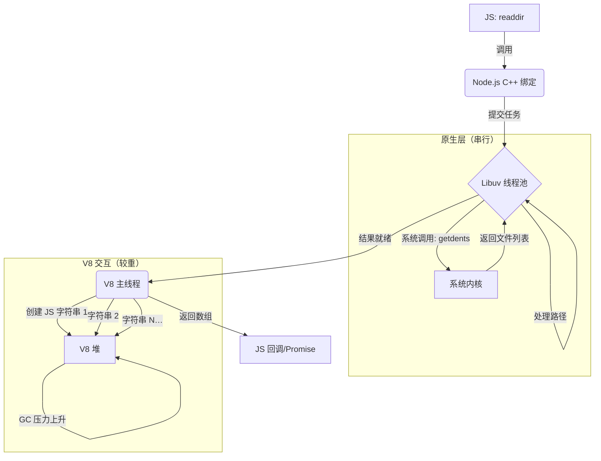
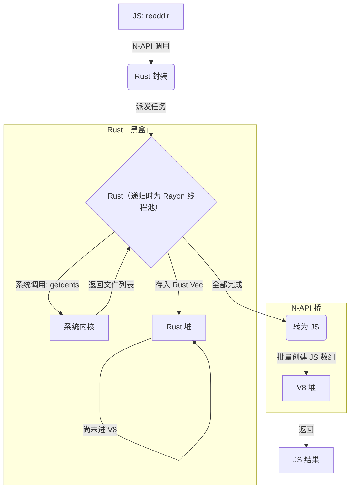

<div align="center">

# Rush-FS

[English](./README.md) | 中文

<p align="center">
  
  
  
  
  <a href="https://github.com/CoderSerio/rush-fs/graphs/contributors"></a>
</p>

<p align="center">
  与 Node.js <code>fs</code> API 对齐，可无痛替换现有项目中的 fs；在海量文件操作场景下获得数倍于内置 fs 的性能，由 Rust 驱动。
</p>

## 安装

```bash
npm install @rush-fs/core
# or
pnpm add @rush-fs/core
```

安装 `@rush-fs/core` 时，包管理器会通过 `optionalDependencies` 自动安装**当前平台**的本地绑定（例如 macOS ARM 上的 `@rush-fs/rush-fs-darwin-arm64`）。若未安装或出现「Cannot find native binding」：

1. 删除 `node_modules` 和锁文件（`package-lock.json` 或 `pnpm-lock.yaml`）后重新执行 `pnpm install`（或 `npm i`）。
2. 或手动安装对应平台包：  
   **macOS ARM：** `pnpm add @rush-fs/rush-fs-darwin-arm64`  
   **macOS x64：** `pnpm add @rush-fs/rush-fs-darwin-x64`  
   **Windows x64：** `pnpm add @rush-fs/rush-fs-win32-x64-msvc`  
   **Linux x64 (glibc)：** `pnpm add @rush-fs/rush-fs-linux-x64-gnu`

**从 `rush-fs` 迁移：** 主包更名为 `@rush-fs/core`，详见 [CHANGELOG.md](./CHANGELOG.md#010)。

## 用法

```ts
import { readdir, stat, readFile, writeFile, mkdir, rm } from '@rush-fs/core'

// 读取目录
const files = await readdir('./src')

// 递归 + 返回文件类型
const entries = await readdir('./src', {
  recursive: true,
  withFileTypes: true,
})

// 读写文件
const content = await readFile('./package.json', { encoding: 'utf8' })
await writeFile('./output.txt', 'hello world')

// 文件信息
const s = await stat('./package.json')
console.log(s.size, s.isFile())

// 创建目录
await mkdir('./new-dir', { recursive: true })

// 删除
await rm('./temp', { recursive: true, force: true })
```

## 性能基准

> 测试环境：Apple Silicon (arm64)，Node.js 24.0.2，release 构建（开启 LTO）。
> 运行 `pnpm build && pnpm bench` 可复现。

### Rush-FS 显著更快的场景

这些场景中 Rust 的并行遍历和零拷贝 I/O 发挥了真正优势：

| 场景                                                             | Node.js   | Rush-FS  | 加速比    |
| ---------------------------------------------------------------- | --------- | -------- | --------- |
| `readdir` 递归（node_modules，约 3 万条目）                      | 281 ms    | 23 ms    | **12x**   |
| `copyFile` 4 MB                                                  | 4.67 ms   | 0.09 ms  | **50x**   |
| `readFile` 4 MB utf8                                             | 1.86 ms   | 0.92 ms  | **2x**    |
| `readFile` 64 KB utf8                                            | 42 µs     | 18 µs    | **2.4x**  |
| `rm` 2000 个文件（4 线程）                                       | 92 ms     | 53 ms    | **1.75x** |
| `access` R_OK（目录）                                            | 4.18 µs   | 1.55 µs  | **2.7x**  |
| `cp` 500 文件平铺目录（4 线程）                                  | 86.45 ms  | 32.88 ms | **2.6x**  |
| `cp` 树形目录 ~363 节点（4 线程）                                | 108.73 ms | 46.88 ms | **2.3x**  |
| `glob` 大树（`node_modules/**/*.json`，约 3 万条目）vs fast-glob | 303 ms    | 30 ms    | **~10x**  |

### 与 Node.js 持平的场景

单文件操作有约 0.3 µs 的 napi 桥接开销。递归 glob 在**小树**上与 node-glob 持平，在**大树**（如 node_modules）上 Rush-FS 明显更快（见上表）。

| 场景                                       | Node.js | Rush-FS | 比率                             |
| ------------------------------------------ | ------- | ------- | -------------------------------- |
| `stat`（单文件）                           | 1.45 µs | 1.77 µs | 1.2x                             |
| `readFile` 小文件（Buffer）                | 8.86 µs | 9.46 µs | 1.1x                             |
| `writeFile` 小文件（string）               | 74 µs   | 66 µs   | 0.9x                             |
| `writeFile` 小文件（Buffer）               | 115 µs  | 103 µs  | 0.9x                             |
| `appendFile`                               | 30 µs   | 27 µs   | 0.9x                             |
| `glob` 递归（`**/*.rs`，小树）vs node-glob | ~22 ms  | ~40 ms  | ~1.8x（此规模下 node-glob 更快） |

### Node.js 更快的场景

极轻量级的内置调用，napi 开销占比较大：

| 场景                       | Node.js | Rush-FS | 说明                     |
| -------------------------- | ------- | ------- | ------------------------ |
| `existsSync`（已存在文件） | 444 ns  | 1.34 µs | Node.js 内部有 fast path |
| `accessSync` F_OK          | 456 ns  | 1.46 µs | 同上——napi 开销占主导    |
| `writeFile` 4 MB string    | 2.93 ms | 5.69 ms | 大字符串跨 napi 桥传输   |

### 并行支持

Rush-FS 在文件系统遍历类操作中使用多线程并行：

| API               | 并行库                                                                    | `concurrency` 选项 | 默认值 |
| ----------------- | ------------------------------------------------------------------------- | ------------------ | ------ |
| `readdir`（递归） | [jwalk](https://github.com/Byron/jwalk)                                   | ✅                 | auto   |
| `glob`            | [ignore](https://github.com/BurntSushi/ripgrep/tree/master/crates/ignore) | ✅                 | 4      |
| `rm`（递归）      | [rayon](https://github.com/rayon-rs/rayon)                                | ✅                 | 1      |
| `cp`（递归）      | [rayon](https://github.com/rayon-rs/rayon)                                | ✅                 | 1      |

单文件操作（`stat`、`readFile`、`writeFile`、`chmod` 等）是原子系统调用，不适用并行化。

### 核心结论

**Rush-FS 在递归/批量文件系统操作上表现卓越**（readdir、glob、rm、cp），Rust 的并行遍历器带来多倍加速（如 readdir 12x、copyFile 50x）。单文件操作与 Node.js 基本持平。napi 桥接带来固定约 0.3 µs 的每次调用开销，仅在亚微秒级操作（如 `existsSync`）中有感知。

**`cp` 基准详情**（Apple Silicon，release 构建）：

| 场景                                  | Node.js   | Rush-FS 1 线程 | Rush-FS 4 线程 | Rush-FS 8 线程 |
| ------------------------------------- | --------- | -------------- | -------------- | -------------- |
| 平铺目录（500 文件）                  | 86.45 ms  | 61.56 ms       | 32.88 ms       | 36.67 ms       |
| 树形目录（宽度=4，深度=3，~84 节点）  | 23.80 ms  | 16.94 ms       | 10.62 ms       | 9.76 ms        |
| 树形目录（宽度=3，深度=5，~363 节点） | 108.73 ms | 75.39 ms       | 46.88 ms       | 46.18 ms       |

`cp` 的最优并发数在 Apple Silicon 上为 **4 线程**——超过后受 I/O 带宽限制，收益趋于平稳。

## 工作原理

以 **`readdir` 为例**：Node.js 在原生层串行执行目录读取，每条结果都在 V8 主线程上转成 JS 字符串，带来 GC 压力：



以 **`readdir` 为例**，Rush-FS 把热路径留在 Rust：先构建 `Vec<String>`（递归时用 Rayon 并行遍历），再一次性交给 JS，遍历过程中不逐条进 V8：



其它提效来源：**递归 `readdir`** 使用 [jwalk](https://github.com/Byron/jwalk) + Rayon 并行遍历目录；**`cp`**、**`rm`**（递归）可通过 Rayon 并行遍历目录树并做 I/O；**`glob`** 支持多线程。整体上，热路径在 Rust、结果一次性（或批量）交给 JS，相比 Node 的 C++ binding 减少了反复进出 V8 与 GC 的开销。

## 状态与路线图

我们正在逐个重写 `fs` 的 API。

> **图例**
>
> - ✅：完全支持
> - 🚧：部分支持 / 开发中
> - ✨：@rush-fs/core 的新增能力
> - ❌：暂未支持

### `readdir`

- **Node.js 参数**：
  ```ts
  path: string; // ✅
  options?: {
    encoding?: string; // 🚧（默认 'utf8'；'buffer' 暂不支持）
    withFileTypes?: boolean; // ✅
    recursive?: boolean; // ✅
    concurrency?: number; // ✨
  };
  ```
- **返回类型**：
  ```ts
    string[]
    | {
      name: string, // ✅
      parentPath: string, // ✅
      isDir: boolean // ✅
    }[]
  ```

### `readFile`

- **Node.js 参数**：
  ```ts
  path: string; // ✅
  options?: {
    encoding?: string; // ✅ (utf8, ascii, latin1, base64, base64url, hex)
    flag?: string; // ✅ (r, r+, w+, a+ 等)
  };
  ```
- **返回类型**：`string | Buffer`

### `writeFile`

- **Node.js 参数**：
  ```ts
  path: string; // ✅
  data: string | Buffer; // ✅
  options?: {
    encoding?: string; // ✅ (utf8, ascii, latin1, base64, base64url, hex)
    mode?: number; // ✅
    flag?: string; // ✅ (w, wx, a, ax)
  };
  ```

### `appendFile`

- **Node.js 参数**：
  ```ts
  path: string; // ✅
  data: string | Buffer; // ✅
  options?: {
    encoding?: string; // ✅ (utf8, ascii, latin1, base64, base64url, hex)
    mode?: number; // ✅
    flag?: string; // ✅
  };
  ```

### `copyFile`

- **Node.js 参数**：
  ```ts
  src: string; // ✅
  dest: string; // ✅
  mode?: number; // ✅ (COPYFILE_EXCL)
  ```

### `cp`

- **Node.js 参数**（Node 16.7+）：
  ```ts
  src: string; // ✅
  dest: string; // ✅
  options?: {
    recursive?: boolean; // ✅
    force?: boolean; // ✅（默认 true）
    errorOnExist?: boolean; // ✅
    preserveTimestamps?: boolean; // ✅
    dereference?: boolean; // ✅
    verbatimSymlinks?: boolean; // ✅
    concurrency?: number; // ✨
  };
  ```

### `mkdir`

- **Node.js 参数**：
  ```ts
  path: string; // ✅
  options?: {
    recursive?: boolean; // ✅
    mode?: number; // ✅
  };
  ```
- **返回类型**：`string | undefined`（recursive 模式下返回首个创建的路径）

### `rm`

- **Node.js 参数**：
  ```ts
  path: string; // ✅
  options?: {
    force?: boolean; // ✅
    maxRetries?: number; // ✅
    retryDelay?: number; // ✅（默认 100ms）
    recursive?: boolean; // ✅
    concurrency?: number; // ✨
  };
  ```

### `rmdir`

- **Node.js 参数**：
  ```ts
  path: string // ✅
  ```

### `stat`

- **Node.js 参数**：
  ```ts
  path: string // ✅
  ```
- **返回类型**：`Stats`
  - 数值字段：`dev`, `mode`, `nlink`, `uid`, `gid`, `rdev`, `blksize`, `ino`, `size`, `blocks`, `atimeMs`, `mtimeMs`, `ctimeMs`, `birthtimeMs`
  - **Date 字段**：`atime`, `mtime`, `ctime`, `birthtime` → `Date` 对象 ✅
  - 方法：`isFile()`, `isDirectory()`, `isSymbolicLink()`, ...
- **错误区分**：`ENOENT` vs `EACCES` ✅

### `lstat`

- **Node.js 参数**：
  ```ts
  path: string // ✅
  ```
- **返回类型**：`Stats`

### `fstat`

- **状态**：❌

### `access`

- **Node.js 参数**：
  ```ts
  path: string; // ✅
  mode?: number; // ✅ (F_OK, R_OK, W_OK, X_OK)
  ```

### `exists`

- **Node.js 参数**：
  ```ts
  path: string // ✅
  ```
- **返回类型**：`boolean`

### `open`

- **状态**：❌

### `opendir`

- **状态**：❌

### `close`

- **状态**：❌

### `unlink`

- **Node.js 参数**：
  ```ts
  path: string // ✅
  ```

### `rename`

- **Node.js 参数**：
  ```ts
  oldPath: string // ✅
  newPath: string // ✅
  ```

### `readlink`

- **Node.js 参数**：
  ```ts
  path: string // ✅
  ```
- **返回类型**：`string`

### `realpath`

- **Node.js 参数**：
  ```ts
  path: string // ✅
  ```
- **返回类型**：`string`

### `chmod`

- **Node.js 参数**：
  ```ts
  path: string // ✅
  mode: number // ✅
  ```

### `chown`

- **Node.js 参数**：
  ```ts
  path: string // ✅
  uid: number // ✅
  gid: number // ✅
  ```

### `utimes`

- **Node.js 参数**：
  ```ts
  path: string // ✅
  atime: number // ✅
  mtime: number // ✅
  ```

### `truncate`

- **Node.js 参数**：
  ```ts
  path: string; // ✅
  len?: number; // ✅
  ```

### `glob`

- **Node.js 参数**：
  ```ts
  pattern: string; // ✅
  options?: {
    cwd?: string; // ✅
    withFileTypes?: boolean; // ✅
    exclude?: string[]; // ✅
    concurrency?: number; // ✨
    gitIgnore?: boolean; // ✨ 默认 false，与 Node.js fs.globSync 一致
  };
  ```

### `symlink`

- **Node.js 参数**：
  ```ts
  target: string // ✅
  path: string // ✅
  type?: 'file' | 'dir' | 'junction' // ✅（仅 Windows 有效，Unix 忽略）
  ```

### `link`

- **Node.js 参数**：
  ```ts
  existingPath: string // ✅
  newPath: string // ✅
  ```

### `mkdtemp`

- **Node.js 参数**：
  ```ts
  prefix: string // ✅
  ```
- **返回类型**：`string`
- 使用系统随机源（Unix: `/dev/urandom`，Windows: `BCryptGenRandom`），最多重试 10 次 ✅

### `watch`

- **状态**：❌

## 更新日志

各版本变更见 [CHANGELOG.md](./CHANGELOG.md)。发布 tag 列表见 [GitHub Releases](https://github.com/CoderSerio/rush-fs/releases)。

## 贡献

参阅 [CONTRIBUTING-CN.md](./CONTRIBUTING-CN.md) 获取完整开发指南：环境搭建、参考 Node.js 源码、编写 Rust 实现、测试与性能基准。

## 发布（维护者专用）

发布由 [Release 工作流](.github/workflows/Release.yml) 完成：在 macOS（x64/arm64）、Windows、Linux 上构建原生二进制，并发布各平台包与主包到 npm。

1. **Secrets：** 在仓库 **Settings → Secrets and variables → Actions** 中添加 **NPM_TOKEN**（npm Classic 或 Automation token，需具备 Publish 权限）。
2. **发布：** 在 **Actions → Release → Run workflow** 中手动运行（使用当前 `main` 上的 `package.json` 版本），或先更新 `package.json` 与 `Cargo.toml` 中的版本号并推送到 `main`，再创建并推送 tag：`git tag v<版本号> && git push origin v<版本号>`。
3. **更新日志：** 发布前或发布后更新 [CHANGELOG.md](./CHANGELOG.md)（将 `[Unreleased]` 下的条目移到新版本标题下并补充 compare 链接）。

工作流会自动注入 `optionalDependencies` 并发布所有包，无需在 `package.json` 中手动填写。

## 许可证

MIT
